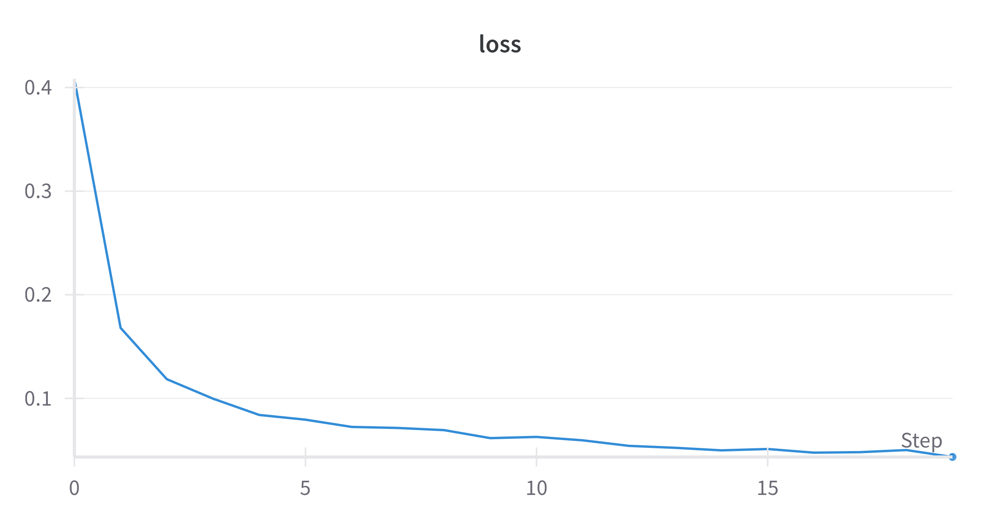
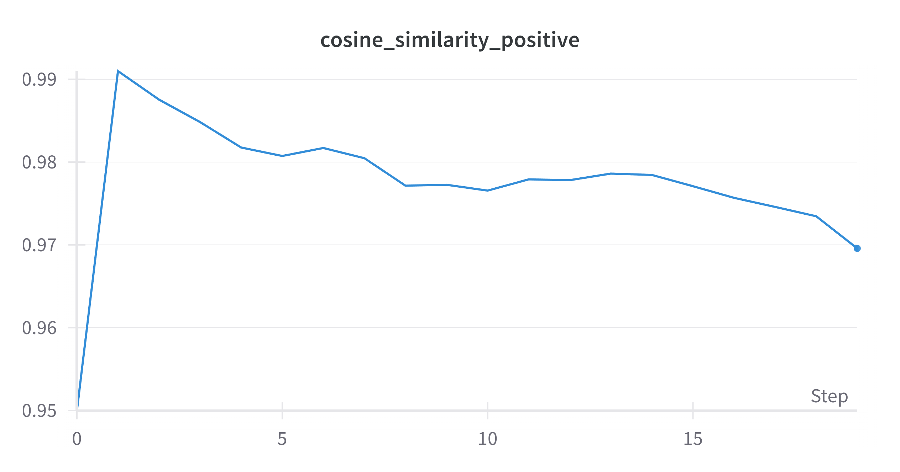

# Speaker Verification Task

## Описание
Этот проект предназначен для верификации спикеров с использованием датасета CSTR VCTK Corpus. Основная цель - обучить модель, которая может различать голоса разных людей, используя подход с Triplet Loss, где векторы для одного спикера должны быть похожими, а для разных - отличаться. В проекте предусмотрены этапы подготовки данных, извлечения мел-спектрограмм, создания триплетов и обучения модели с архитектурой на основе CNN.

## Структура проекта:
- data_preprocessing.py: обработка данных, включая извлечение мел-спектрограмм и подготовку данных для обучения.
- dataset.py: реализация класса для загрузки данных и создания триплетов (Anchor, Positive, Negative).
- model.py: архитектура модели на основе сверточных нейронных сетей (CNN) для извлечения признаков из аудио.
- train.py: основной файл для запуска процесса обучения модели с использованием Triplet Loss и мониторингом метрик.
- triplet_utils.py: функции для реализации Triplet Loss и вычисления косинусного сходства.
- clearml_setup.py: настройка для интеграции с системами мониторинга ClearML и Weights & Biases (уже удален).

## Основные этапы:
1. Подготовка данных: извлечение мел-спектрограмм с помощью torchaudio и сохранение их вместе с метками спикеров.
2. Создание триплетов: генерация пар (Anchor, Positive, Negative) для каждого спикера, чтобы минимизировать расстояние между похожими голосами и увеличивать расстояние между разными.
3. рхитектура модели: модель CNN обучается извлекать векторы признаков из аудио, которые будут использоваться для дальнейшего сравнения.
4. Обучение: использование Triplet Loss для оптимизации модели. Мониторинг процесса обучения ведется через Weights & Biases с выводом метрик, таких как потери и косинусное сходство.

## Графики:

## Анализ полученных результатов

### Loss (Потери):

Потери в процессе обучения стабильно снижаются с 0.4081 на первой эпохе до 0.0434 на двадцатой эпохе.
Это указывает на то, что модель успешно минимизирует Triplet Loss, т.е. становится лучше в различении векторов одного и разных спикеров. Чем меньше потери, тем более эффективна модель в разделении классов (разных спикеров) и объединении похожих данных (одного спикера).

### Косинусное сходство для Positive пар (Cosine Sim Pos):

Начальное значение косинусного сходства между Anchor и Positive векторами (0.9500) уже было высоким, что указывает на то, что векторы одного спикера были схожими. Это хорошее начало.
В процессе обучения модель улучшила это значение, увеличив его до 0.9696-0.9910. Это означает, что модель успешно учится делать векторы одного спикера максимально схожими.

### Косинусное сходство для Negative пар (Cosine Sim Neg):

Начальное значение косинусного сходства для Anchor и Negative (0.8886) указывает на то, что модель в начале обучения плохо различала разных спикеров (векторы были слишком похожи).
По мере обучения сходство начало уменьшаться, и к последней эпохе оно снизилось до 0.8584. Это показывает, что модель научилась лучше различать голоса разных спикеров, но все еще может улучшить результаты.

### Общее поведение метрик:

Потери стабильно снижаются, что свидетельствует об улучшении модели.
Косинусное сходство Positive пар остается высоким (близким к 1.0), что подтверждает способность модели делать векторы одного спикера схожими.
Косинусное сходство Negative пар медленно снижается, показывая, что модель постепенно учится делать векторы разных спикеров менее схожими.
Показатели потерь и косинусного сходства указывают на успешное обучение модели, но возможны дополнительные улучшения.

### Общий вывод:

Результаты показывают успешное обучение модели: она стабильно снижает потери и увеличивает сходство векторов одного спикера, но также остается потенциал для улучшения различения разных спикеров. Модель можно сделать более точной путем настройки гиперпараметров и возможных архитектурных изменений.